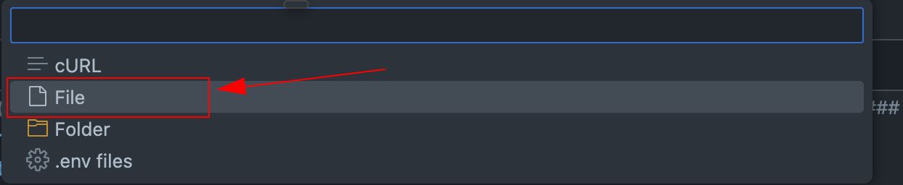

# Simple Meteorology API *(Spring Boot App)* in ***DevContainer***

Simples aplicação Spring Boot para teste de ambiente de desenvolvimento em containers.

## Índice
- [Sobre](#sobre)
- [Obtendo o projeto](#obtendo-o-projeto)
- [Como executar](#como-executar)
	- [Executando o projeto no ***DevContainer*** a partir do VS Code](#executando-o-projeto-no-devcontainer-a-partir-do-vs-code)
		- [Pré-Requisitos](#pré-requisitos-devcontainer)
		- [Executando o app Spring Boot](#executando-o-app-spring-boot)
- [Testando a aplicação via ***Postman***](#testando-a-aplicação-via-postman)
- [Acessando a interface de gerenciamento do banco de dados (PgAdmin)](#acessando-a-interface-de-gerenciamento-do-banco-de-dados-pgadmin)
- [Como executar fora do DevContainer](#como-executar-fora-do-devcontainer)
	- [Pré-Requisitos](#pré-requisitos-local)
	- [Com build da imagem](#com-build-da-imagem)
	- [Sem build da imagem](#sem-build-da-imagem)
- [Detalhes do projeto](#detalhes-do-projeto)

## Sobre
Simples aplicação Spring Boot para testes de ambiente de desenvolvimento em containers (DevContainer).

Essa API REST possui um recurso `/v1/temperatures` com dois endpoints para gravação e leitura de dados de temperatura.

- Recursos:
	- Temperatures (`/v1/temperatures`)
		- `POST` - Criação
			- Exemplo de *body* da requisição (`application/json`)
			```json
			{
				"celsiusValue": 32.5,
				"latitude": -15.24,
				"longitude": -55.16
			}
			```
		- `GET` - Listagem
		- Exemplo de *body* da resposta (`application/json`)
			```json
			[
				{
					"id": 1,
					"celsiusValue": 32.5,
					"latitude": -15.24,
					"longitude": -55.16,
					"createdAt": "2025-09-27T13:43:59.788650Z"
				}
			]
			```

**O objetivo desse projeto é mostrar a compilação, execução e interação de um app Spring Boot dentro do ambiente de DevContainer,
o foco não é o desenvolvimento de APIs REST.**

### Ambiente de desenvolvimento com ***DevContainer***
***DevContainer*** é uma especificação aberta que padroniza e permite um meio de usar containers como um ambiente completo de desenvolvimento e depuração.

Mais informações podem ser encontradas em https://containers.dev/.

## Obtendo o projeto

- Realize o clone do repositório:
    ```console
	git clone
	```
- Abra o projeto no VS Code:
    ```console
	code devcontainers-example-meteorology
	```

## Como executar

### Executando o projeto no DevContainer a partir do VS Code

#### Pré-Requisitos ***DevContainer***

##### Exposição de portas no DevContainer

- As portas padrão expostas são:
	- `8082` (Aplicação)
	- `5432` (PostgreSQL)
	- `5050` (PgAdmin)

Caso alguma dessas portas seja informada diferente no arquivo `/.devcontainer/.env`, então verificar no arquivo `/.devcontainer/devcontainer.json` a seguinte configuração abaixo e modificar conforme necessário:
```json
"forwardPorts": [8082, 5432, 5050]
```

##### Configuração de variáveis de ambiente

- Copiar o arquivo `.env.template` para a pasta `.devcontainer` , renomear para apenas `.env` e substituir os valores necessários.
	>As variáveis que devem ser configuradas estão documentadas dentro do arquivo.

##### Carregamento do ambiente

- No VS Code:
	1. Apertar a tecla **F1** e selecionar a opção ***"Developer: Reload Window"***.
	2. Verificar se é exibido um *pop-up* com a opção ***"Reopen in Container"*** e clicar nessa opção.
	3. Abrir a aplicação no ***DevContainer*** e aguardar o início dos serviços necessários.


#### Executando o app Spring Boot

Após os passos anteriores, abrir um novo terminal (***workspaces***) que estará disponível para executar comandos dentro do ambiente de desenvolvimento.

- Executando a aplicação a partir do plugin do *Spring Boot* para *Maven*:
	```console
	./mvnw spring-boot:run -Dspring-boot.run.profiles=dev
	```

- Executando a aplicação com `java -jar`:
	```console
	./mvnw clean package -DskipTests
	```
	```console
	java -Dspring.profiles.active=dev -jar target/algaworks-idk-devcontainers-examples-meteorology-0.0.1-SNAPSHOT.jar
	```

## Testando a aplicação via ***Postman***

Está incluso no projeto a pasta `.postman` com a *collection* necessária para testar os endpoints da API.

- Importando o arquivo na extensão do Postman dentro do VS Code:
	- Na barra de pesquisas do VS Code digitar `>Postman: Import`.
	
	- Selecione a opção `FILE``
	
	- Selecione o arquivo `/.postman/Meteorology.postman_collection.json`
	
	
	- Após isso a *collection* aparecerá disponível dentro da extensão no VS Code para teste</br>
	
	
## Acessando a interface de gerenciamento do banco de dados ***PgAdmin***

Para acessar a iterface de gerenciamento do DB via navegador, basta acessar a url abaixo com a porta, usuário e senha previamente configurados no `.env` ou `.env.dev`.

- Exemplo
	```console
	http://localhost:5050/
	```

>Para fins de praticidade, foi utilizado nesse projeto a *feature* de [*Import/Export Servers*](https://www.pgadmin.org/docs/pgadmin4/development/import_export_servers.html#json-format) no PgAdmin através do arquivo `/docker/servers.json` sendo montado em `/pgadmin4/servers.json` no container referente ao PgAdmin.

Dessa forma o servidor de banco de dados já aparecerá registrado automaticamente na ferramenta, **sem necessidade de configuração manual**.


## Como executar fora do DevContainer

Em alguns casos pode ser necessário executar e testar a aplicação antes de utilizar o ambiente em DevContainer.

Abaixo seguem os passos para a execução em ambiente de desenvolvimento convencional.

### Pré-requisitos Local

##### Configuração de variáveis de ambiente
- Copiar o arquivo `.env.template` e renomear a cópia para apenas `.env.dev` e substituir os valores necessários.
	>As variáveis que devem ser configuradas estão documentadas dentro do arquivo.

### Com build da imagem

- Diretamente com `docker compose`
	- Subir os containers
	```console
	docker compose --env-file .env.dev -f docker-compose-dev.yml up --build
	```
	- Parar os containers
	```console
	docker compose --env-file .env.dev -f docker-compose-dev.yml down
	```

- A partir do `Makefile`
	- Subir os containers
	```console
	make up-dev
	```
	- Parar os containers
	```console
	make down-prod
	```
	- Outras opções como logs e listagem dos containers estão presentes no `Makefile`, bastando digitar o comando abaixo para obter ajuda
	```console
	make help 
	```

### Sem build da imagem

- Subir os serviços necessários (Postgres e PgAdmin)
	- Diretamente com `docker compose`
		```console
		docker compose --env-file .env.dev -f docker-compose-tools.yml up
		```
	- A partir do `Makefile`
		```console
		make up-dev-tools
		```

- Os passos para executar a aplicação são os mesmos citados em [Executando o app Spring Boot](#executando-o-app-spring-boot) mas utilizando o *profile* para `dev-local`.

- Após finalizar o desenvolvimento, finalizar o ferramental
	- Diretamente com `docker compose`
		```console
		docker compose --env-file .env.dev -f docker-compose-tools.yml down
		```
	- A partir do `Makefile`
		```console
		make down-dev-tools
		```

## Detalhes do projeto

Descrição dos principais arquivos utilizados:

- `application-dev.yml`
	>*Profile* para desenvolvimento com suporte de containers (Com ou sem DevContainer). Configurações por padrão baseadas nas variáveis de ambiente carregadas.

- `application-dev-local.yml`
	>*Profile* para desenvolvimento local com suporte de containers (Apenas dependências/serviços). Configurações informadas diretamente.

- `application.yml`
	>*Profile padrão* que define as configurações comuns que vão ser sobreescritas por outros *profiles*.

- `.devcontainer`
	>Pasta que contém os arquivos de configuração para execução com ***DevContrainer***.
	- `devcontainer.json`
		>Configuração de imagem base e plugins que vão ser instalados no ambiente de desenvolvimento.
	- `docker-compose-devcontainer.yml`
		>Compose específico para uso no DevContainer (Reutiliza os compose de desenvolvimento (`docker-compose-tools.yml` e `docker-compose-dev.yml`)).

- `docker/pgamin/servers.json`
	>Arquivo de definição de Grupos/Servidores usado com *bind-mount* no compose para registrar automaticamente o servidor PostgreSQL na ferramenta PgAdmin.

- `docker-compose-tools.yml`
	>Compose para as ferramentas (banco de dados) utilizadas durante o desenvolvimento.

- `docker-compose-dev.yml`
	>Compose para ambiente de desenvolvimento fora do ***DevContainer*** (Sobe as ferramentas, faz build da imagem da aplicação e executa um container da mesma).
- `.env.template`
	>Arquivo de exemplo para configuração do `.env` ou `.env.dev` para configuração de variáveis de ambiente.
	- `.env` para uso dentro do ***Devcontainer*** devido a convenção (Até o momento não é possível personalizar o nome do `.env`).
	- `.env.dev` em ambiente de desenvolvimento normal, para diferenciar do `.env` de **produção**.

- `Makefile` (Necessário ter o **Make** instalado no sistema operacional)
	>Arquivo para automação, utilizado nesse caso como atalho para facilitar a execução dos comandos de gerenciamento dos containers quando precisar executar fora do DevContainer por exemplo.